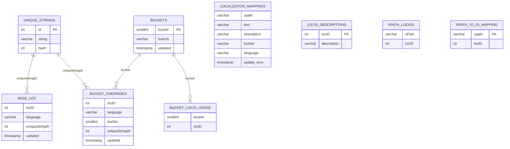

# Localization CSV Importer

A small Java utility for importing localization CSV files into a MySQL database.

## Overview

This project reads a CSV file containing localization entries and inserts rows into `unique_strings` and `base_loc` tables. It avoids duplicate `unique_strings` entries by checking existing records before inserting.

## Database schema



## Prerequisites

- Java 11
- Maven
- MySQL database
- `db.properties` file at the project root

## Configuration

Create a `db.properties` file in the project root with the following properties:

```properties
# Example db.properties
# db.url=jdbc:mysql://localhost:3306/your_database?useSSL=false&serverTimezone=UTC
# db.user=username
# db.password=password
```

## Build

From the project root, run:

```bash
mvn package
```

This creates a shaded executable JAR with the main class `com.bhg.LocalizationCsvImporter`.

## Usage

```bash
java -jar target/localization-csv-importer-1.0-SNAPSHOT.jar <csv_file> [--skip-first-line=true|false]
```

- `<csv_file>`: CSV file path to import
- `--skip-first-line=true|false`: optional flag to skip the first row

The importer expects CSV file names in the format:

```text
loc_<language>_<version>_<name>.csv
```

The language code is derived from the second underscore-separated segment of the file name.

## Example

```bash
java -jar target/localization-csv-importer-1.0-SNAPSHOT.jar csv/loc_en-us_8000_commanderStyle_parts_0.csv --skip-first-line=true
```

## Notes

- The application uses OpenCSV for reading CSV files.
- It inserts unique strings into `unique_strings` and mapping records into `base_loc`.
- If a `base_loc` row for the same `locID` and language already exists, it is skipped.
